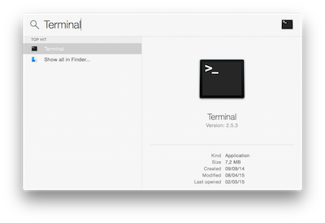
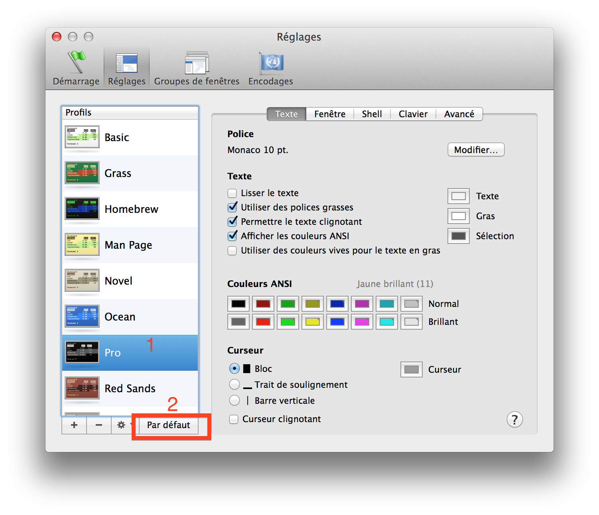

# Setup instructions

The following instructions will help you to get ready for the Imbue Javascript path.

- Grab a text editor, where you'll spend your day and nights
- Install a package manager
- Pimp your Terminal
- Setup git and GitHub
- Install Node
  

## Command Line Tools

Open the Terminal (click the magnifying glass icon in the top right corner of your screen and type `Terminal`):

</img>

Copy-paste the following command in the terminal and hit Enter.

```bash
xcode-select --install
```

If you'll receive the following message, you can just skip this step and go to next step.

```
# command line tools are already installed, use "Software Update" to install updates
```

Otherwise, it will open a window asking you if you want to install some software. Accept and wait. If it fails, try again the command line above, sometimes the Apple servers are overloaded.


</img>

While it's downloading, you can go on with configuring your GitHub account, but **stop** before Homebrew. You'll need the command line tools installed for that step.


## GitHub account

Have you signed up to GitHub? If not, [do it right away](https://github.com/join).

:point_right: **[Upload a picture](https://github.com/settings/profile)** and put your name correctly on your GitHub account. This is important as we'll use an internal dashboard with your avatars. Please do it **now**.


## Homebrew

On Mac, you need to install [Homebrew](http://brew.sh/) which is a Package Manager.
It will be used as soon as we need to install some software.
To do so, open your Terminal and run:

```bash
ruby -e "$(curl -fsSL https://raw.githubusercontent.com/Homebrew/install/master/install)"
```

This will ask for your confirmation (hit `Enter`) and your laptop session password.

If you already have Homebrew, it will tell you so, that's fine, go on.

Then install some useful software:

```bash
brew update
```

If you get a `/usr/local must be writable` error, just run this:

```bash
sudo chown -R $USER:admin /usr/local
brew update
```

Error message or not, proceed running the following in the terminal (you can copy / paste all the lines at once).

```bash
function install_or_upgrade { brew ls | grep $1 > /dev/null; if (($? == 0)); then brew upgrade $1; else brew install $1; fi }
install_or_upgrade "git"
install_or_upgrade "wget"
install_or_upgrade "imagemagick"
install_or_upgrade "jq"
install_or_upgrade "openssl"
```

## VSCode - Your text editor

1 - [Download Visual Studio](https://go.microsoft.com/fwlink/?LinkID=534106) Code for macOS.
2 - Double-click on the downloaded archive to expand the contents.
3 - Drag `Visual Studio Code.app` to the Applications folder, making it available in the Launchpad.
4 - Add VS Code to your Dock by right-clicking on the icon to bring up the context menu and choosing Options, Keep in Dock.


## Sublime Text 3 - Your text editor

A text editor is one of the most important tools of a developer. Go to [this page](http://www.sublimetext.com/3) and download **Sublime Text 3** for OS X. Install it (double click the downloaded file and drag & drop the app **into** the `Applications` folder, **don't skip this**). If you had Sublime Text 2 installed before, please uninstall it (by dragging/dropping it to the Trash).

Sublime Text is free without any time limitation but a popup will appear every ten saves to remind you there is a license to buy. You can hit `Esc` when this happens, but feel free to buy Sublime Text if you really like this one (there are alternatives).

Again, make sure that Sublime Text is there, not in the disk image you downloaded. To make sure it's correct, once Sublime Text is installed, unmount the "Sublime Text 3" disk in the left panel of Finder. Finder will complain if something went wrong. Ask a teacher.


## Oh-my-zsh - Fancy your Terminal

We will use the shell named `zsh` instead of `bash`, the default one.

```bash
sh -c "$(curl -fsSL https://raw.githubusercontent.com/robbyrussell/oh-my-zsh/master/tools/install.sh)"
```

Be careful, at the end of this script, it will prompt for your laptop password again. You have to write it correctly (you will not see it when you type) and hit `Enter`. You should get something like:

```bash
         __                                     __
  ____  / /_     ____ ___  __  __   ____  _____/ /_
 / __ \/ __ \   / __ `__ \/ / / /  /_  / / ___/ __ \
/ /_/ / / / /  / / / / / / /_/ /    / /_(__  ) / / /
\____/_/ /_/  /_/ /_/ /_/\__, /    /___/____/_/ /_/
                        /____/                       ....is now installed!
````

Now quit the Terminal (`⌘` + `Q`), and restart it.

You should see something like this:


</img>


On Mac, open `Terminal > Preferences` and set the "Pro" theme as default in `Profiles` (*`Réglages`* in French).

</img>


Quit and relaunch the Terminal. It should now have a nice black background, more easy on the eyes.


## GitHub

We need to generate SSH keys which are going to be used by GitHub and Heroku
to authenticate you. Think of it as a way to log in, but different from the
well known username/password couple. If you already generated keys
that you already use with other services, you can skip this step.

Open a terminal and type this, replacing the email with **yours** (the
same one you used to create your GitHub account). It will prompt
for information. Just press enter until it asks for a **passphrase**.

```bash
mkdir -p ~/.ssh && ssh-keygen -t ed25519 -o -a 100 -f ~/.ssh/id_ed25519 -C "TYPE_YOUR_EMAIL@HERE.com"
```

**NB:** when asked for a passphrase, put something you want (and that you'll remember),
it's a password to protect your private key stored on your hard drive. You'll type,
nothing will show up on the screen, **that's normal**. Just type the passphrase,
and when you're done, press `Enter`.

Then you need to give your **public** key to GitHub. Run:

```bash
cat ~/.ssh/id_ed25519.pub
```

It will prompt on the screen the content of the `id_ed25519.pub` file. Copy that text,
then go to [github.com/settings/ssh](https://github.com/settings/ssh). Click on
**Add SSH key**, fill in the Title with your computer name, and paste the **Key**.
Finish by clicking on the **Add key** green button.

To check that this step is completed, in the terminal run this. You will be
prompted a warning, type `yes` then `Enter`.

```bash
ssh -T git@github.com
```

If you see something like this, you're done!

```bash
# Hi --------! You've successfully authenticated, but GitHub does not provide shell access
```

If it does not work, try running this before trying again the `ssh -T` command:

```bash
ssh-add ~/.ssh/id_ed25519
```

Don't be in a rush, take time to [read this article](http://sebastien.saunier.me/blog/2015/05/10/github-public-key-authentication.html) to get a better
understanding of what those keys are used for.

## Installing node

1 - Go to the [Node.js Downloads](https://nodejs.org/en/download/) page
2 - Download Node.js for macOS by clicking the "Macintosh Installer" option
3 - Run the downloaded Node.js `.pkg` Installer
4 - Run the installer, including accepting the license, selecting the destination, and authenticating for the install.
5 - You're finished! To ensure Node.js has been installed, run `node -v` in your terminal - you should get something like v6.9.4


## Slack

[Download](https://itunes.apple.com/fr/app/slack/id803453959?mt=12) the Slack native app from the mac App Store, and sign in to `lewagon-alumni` organization.

Make sure you upload a picture there.

You can also sign in to Slack on your iPhone or Android device!

The idea is that you'll have Slack open all day, so that you can share useful links / ask for help / decide where to go to lunch / etc.


## Keyboard

As you become a programmer, you'll understand that leaving the keyboard takes a lot of time,
so you'll want to minimize using the trackpad or the mouse. Here are a few tricks on OSX
to help you do that:

### Keyboard speed

Go to  > System Preferences > Keyboard. Set `Key Repeat` to the fastest position (to the right) and
`Delay Until Repeat` to the shortest position (to the right).

### Full Keyboard Access

Go to  > System Preferences > Keyboard. Click on the third tab (Shortcuts). At the bottom of the
pane, click the radio button `All controls`. This way when you get a dialog with several options,
you'll be able to type `Enter` to confirm, or `Space` to choose the cancel option. If you have more than
two options, you can use tab to circle between them.

### macOS For hackers

[Read this script](https://github.com/mathiasbynens/dotfiles/blob/master/.macos) and cherry-pick some stuff you think will suit you.
For instance, you can type in the terminal this one:

```bash
# Expanding the save panel by default
defaults write NSGlobalDomain NSNavPanelExpandedStateForSaveMode -bool true
defaults write NSGlobalDomain PMPrintingExpandedStateForPrint -bool true
defaults write NSGlobalDomain PMPrintingExpandedStateForPrint2 -bool true

# Save screenshots to the Desktop (or elsewhere)
defaults write com.apple.screencapture location "${HOME}/Desktop"

# etc..
```

